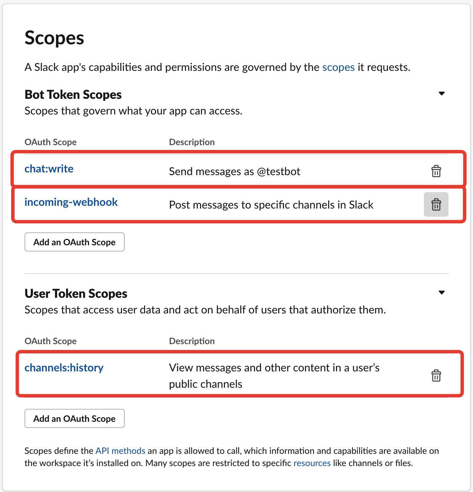
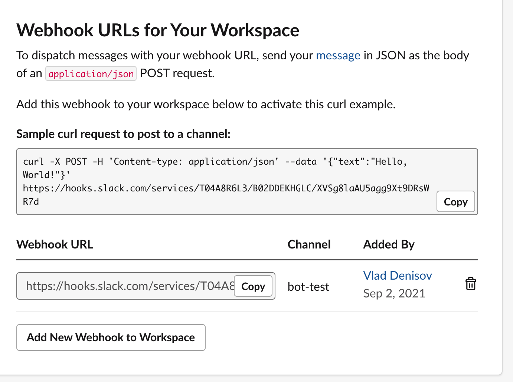
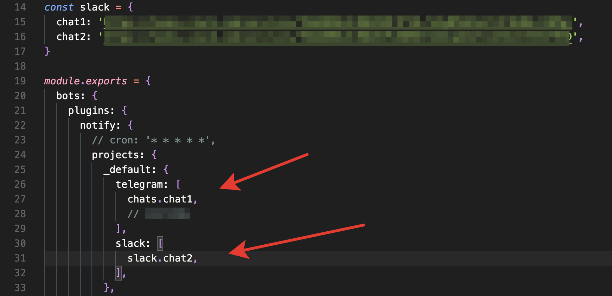

# LSK.js – bots-provider-slack

> @lskjs/bots-provider-slack – LSK.js plugin for @lskjs/bots module for telegram, slack, discord, whatsapp, twitter, instagram and vk bots creation

[](https://github.com/lskjs)
[](https://www.npmjs.com/package/@lskjs/bots-provider-slack)
[](https://www.npmjs.com/package/@lskjs/bots-provider-slack)
[](https://bundlephobia.com/result?p=@lskjs/bots-provider-slack)
[](https://www.npmjs.com/package/@lskjs/bots-provider-slack)
[](https://bundlephobia.com/result?p=@lskjs/bots-provider-slack)
[](https://bundlephobia.com/result?p=@lskjs/bots-provider-slack)
[](https://github.com/lskjs/lskjs/blob/master/LICENSE)
[](https://t.me/lskjschat)

<!-- template file="scripts/templates/preview.md" start -->

<!-- template end -->

***

<!-- # 📒 Table of contents  -->

# Table of contents

*   [⌨️ Install](#️-install)
*   [Как создать бота в Slack](#как-создать-бота-в-slack)
*   [📖 License](#-license)
*   [👥 Contributors](#-contributors)
*   [👏 Contributing](#-contributing)
*   [📮 Any questions? Always welcome :)](#-any-questions-always-welcome-)

# ⌨️ Install

```sh
# yarn
yarn i @lskjs/bots-provider-slack lodash

# npm
npm i @lskjs/bots-provider-slack lodash
```

***

# Как создать бота в Slack

1.  Заходим на сайт с приложениями slack’а: https://api.slack.com/apps.

2.  Клик `Create New App`


3.  Клик `From scratch`


4.  Вводим имя бота и выбираем для него рабочее пространство. Далее жмем `Create App`.


5.  Клик `Bots`


6.  Клик `Review Scopes to Add`.


7.  Спускаемся ниже и выдаем боту следующие права:



8.  Далее переходим во вкладку с хуками.


9.  Кликаем на кнопку и добавляем хуки.


10. Выбираем чат, для которого хотим создать хук.


11. Получаем хук, который можем скопировать и положить в конфиг. Этот url представляет из себя аналог telegram-chatId. Для каждого чата необходимо создать свой вебхук.



12. В .env.js url-хук используется аналогично с chatId. Подробнее про конфиги в документации к bots-plugin-notify и bots-plugin-prometheus.



13. После добавления всех хуков необходимо поместить бота в рабочую область.


# 📖 License

This project is licensed under the MIT License - see the [LICENSE](LICENSE) file for details

# 👥 Contributors

<!-- ALL-CONTRIBUTORS-LIST:START - Do not remove or modify this section -->

<!-- prettier-ignore-start -->

<!-- markdownlint-disable -->

<table>
  <tr>
    <td align="center"><a href="https://isuvorov.com"><br /><sub><b>Igor Suvorov</b></sub></a><br /><a href="lskjs/lskjs///commits?author=isuvorov" title="Code">💻</a> <a href="#design-isuvorov" title="Design">🎨</a> <a href="#ideas-isuvorov" title="Ideas, Planning, & Feedback">🤔</a></td>
  </tr>
</table>
<!-- markdownlint-restore -->
<!-- prettier-ignore-end -->
<!-- ALL-CONTRIBUTORS-LIST:END -->

# 👏 Contributing

1.  Fork it (<https://github.com/yourname/yourproject/fork>)
2.  Create your feature branch (`git checkout -b features/fooBar`)
3.  Commit your changes (`git commit -am 'feat(image): Add some fooBar'`)
4.  Push to the branch (`git push origin feature/fooBar`)
5.  Create a new Pull Request

# 📮 Any questions? Always welcome :)

*   [Email](mailto:hi@isuvorov.com)
*   [LSK.news – Telegram channel](https://t.me/lskjs)
*   [Спроси нас в телеграме ;)](https://t.me/lskjschat)
